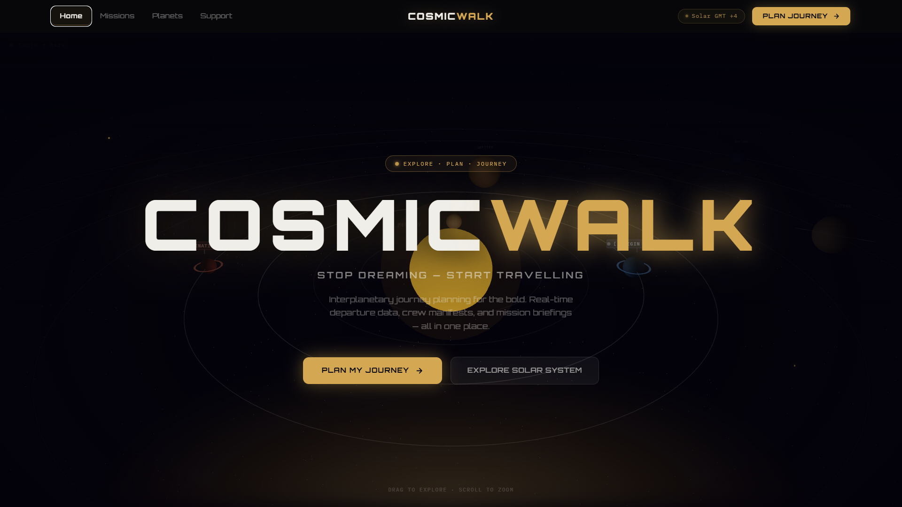
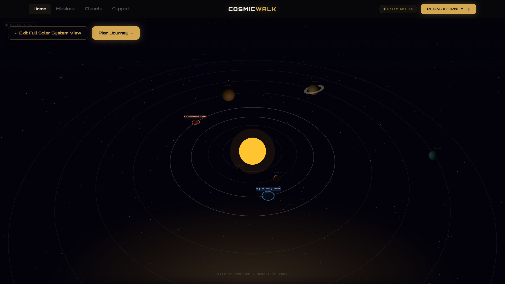

# CosmicWalk - Interplanetary Planner 🎯

## Basic Details
### Team Name: Omega

### Team Members
- Member 1: Vinay S Nair - TKM College of Engineering
- Member 2: Sajeer F M - TKM College of Engineering

### Project Description
CosmicWalk is an unnecessarily serious calculator for walking between planets. Find out how many steps, shoes, snacks, and questionable life choices it takes to reach your next favourite planet—and whether you’ll survive the journey.

### The Problem (that doesn't exist)
If someone wants to travel from one planet to another, how are they supposed to get the necessary info?

### The Solution (that nobody asked for)
Our project used high level calculations and computations that use well researched information to get you the best possible planning for your next interplanar journey.

## Technical Details
### Technologies/Components Used
For Software:
- Languages - Python, TypeScript
- Frameworks - React (with Vite)
- Libraries & tools - Tailwind CSS, Framer Motion, Three.js

### Implementation
For Software:
# Installation
Clone the repository and install the dependencies.

git clone <your-repository-url>
cd CosmicWalk

cd frontend
npm install

cd ../backend
pip install -r requirements.txt

# Run
For frontend - npm run dev
For backend - uvicorn app.main:app --reload

### Project Documentation
For Software:
CosmicWalk is a web-based interplanetary walking calculator that combines astronomical distance data, walking-speed assumptions, and a 3D planetary interface to estimate the requirements of travelling between planets.

The application allows users to:

Select a starting planet and destination.
Visualize planets through an interactive 3D interface.
Calculate walking distance and estimated travel time.
Estimate steps, shoes, snacks, and other unnecessarily important journey requirements.
Explore the results through animated transitions.

# Screenshots (Add at least 3)
<table>
  <tr>
    <td></td>
    <td></td>
  </tr>
  <tr>
    <td align="center">Journey Planner</td>
    <td align="center">3D Solar System</td>
  </tr>
</table>

## Team Contributions
- Sajeer F M: Backend
- Vinay S Nair: Frontend

---
Made with ❤️ at TinkerHub Useless Projects 

